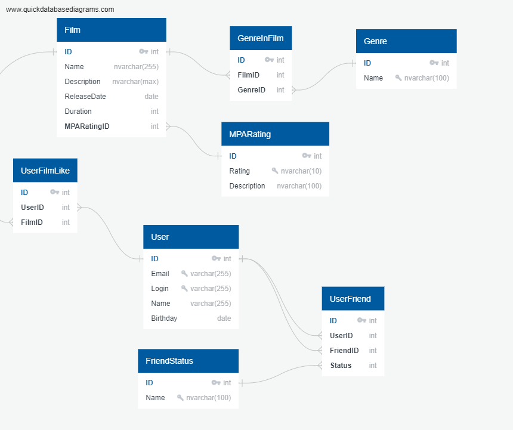

# Filmorate-java (Выбор фильмов)


## Обзор
С каждым годом количество выпускаемых фильмов увеличивается, а вместе с ним и разнообразие рейтингов, что усложняет выбор следующего фильма для просмотра. Но не беспокойтесь! Filmorate — это серверное приложение для управления фильмами и рейтингами пользователей, предлагающее отобранный список топ-5 рекомендуемых фильмов для просмотра. Этот сервис гарантирует, что вы и ваши друзья проведете меньше времени за выбором и больше времени за просмотром.

## Начало работы

### Предварительные требования
- JDK 11 или новее
- Maven 3.6 или новее
- Spring Boot 2.4 или новее
- Любая IDE, поддерживающая Java (IntelliJ IDEA, Eclipse, VS Code)

### Установка
Клонируйте репозиторий:
```bash
git clone https://github.com/yourusername/filmorate.git
```
Перейдите в директорию проекта:

```bash
cd filmorate
```
Соберите проект с помощью Maven:
```bash
mvn clean install
```
Запустите приложение:
```bash
mvn spring-boot:run
```

# Валидация

Данные, которые могут приходить в запросе на добавление нового фильма или пользователя. Эти данные должны 
соответствовать определённым критериям.

**Для Film:**
- Название не может быть пустым.
- Максимальная длина описания — 200 символов.
- Дата релиза — не раньше 28 декабря 1895 года.
- Продолжительность фильма должна быть положительным числом.

**Для User:**
- Электронная почта не может быть пустой и должна содержать символ `@`.
- Логин не может быть пустым и содержать пробелы.
- Имя для отображения может быть пустым — в таком случае будет использован логин.
- Дата рождения не может быть в будущем.

# Логирование
В проекте есть логирование на библиотеке sl4j для операций, 
которые изменяют сущности — добавляют и обновляют их. 
Также логируются причины ошибок — например, 
если валидация не пройдена. 

# Модели данных

## Структура пакетов
Создайте пакет с именем `model`. Внутри добавьте два класса: `Film` и `User`, которые являются моделями данных приложения.

### Свойства model.Film
- **id** (Integer): Уникальный идентификатор фильма.
- **name** (String): Название фильма.
- **description** (String): Описание фильма.
- **releaseDate** (LocalDate): Дата выпуска фильма.
- **duration** (Integer): Продолжительность фильма в минутах.

### Свойства model.User
- **id** (Integer): Уникальный идентификатор пользователя.
- **email** (String): Адрес электронной почты пользователя.
- **login** (String): Логин пользователя.
- **name** (String): Отображаемое имя пользователя.
- **birthday** (LocalDate): Дата рождения пользователя.

## REST-контроллеры

### Реализация
Создайте два контроллера: `FilmController` для управления операциями с фильмами и `UserController` для управления операциями с пользователями. Убедитесь, что эти контроллеры следуют принципам REST.

### Конечные точки

#### FilmController
- `POST /films`: Добавить новый фильм.
- `PUT /films/{id}`: Обновить существующий фильм.
- `GET /films`: Получить все фильмы.

#### UserController
- `POST /users`: Создать нового пользователя.
- `PUT /users/{id}`: Обновить существующего пользователя.
- `GET /users`: Получить всех пользователей.


# ER диаграмма базы данных (БД)
Ссылка https://app.quickdatabasediagrams.com/#/d/Qndfao


## Обзор

## Об авторе

**Степан Бокарев**

*Студент ЯндексПрактикума*

### Биография
- Выпускник МАИ, программная инженерия. Год окончания 2024 г.


### Контакты
- Email: [bokarevstepa@yandex.ru](mailto:bokarevstepa@yandex.ru)
- GitHub: [github.com/Stepan5024](https://github.com/Stepan5024)
